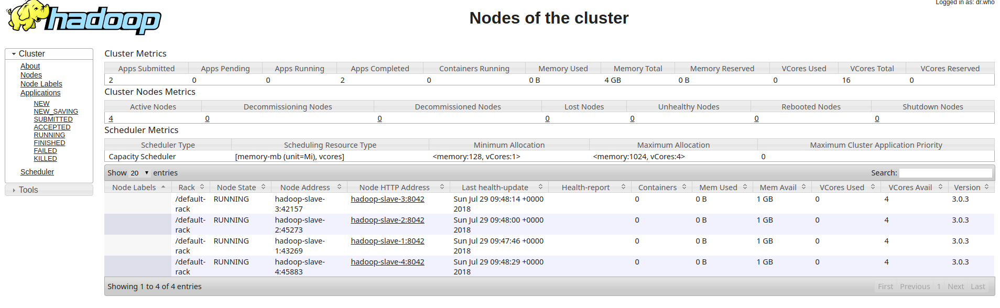

# hadoop-pi

### Install datanode

`sudo ./install.sh`

### Install namenode

`sudo ./install.sh MASTER`

`sudo` access needed to install Hadoop. 

### Configure hosts

In `hadoop-config-master`, modify `slaves` and `hosts` for your network configuration. 

### Verify

`hdfs dfsadmin -report`

## Examples

Replace `3.0.3` in any filenames with your Hadoop version.

### 1) wordcount

Copy a file to HDFS:

`hdfs dfs -copyFromLocal /usr/local/hadoop/LICENSE.txt /license.txt`

Run the wordcount example:

`yarn jar /usr/local/hadoop/share/hadoop/mapreduce/hadoop-mapreduce-examples-3.0.3.jar wordcount /license.txt /test`

Dump the result to terminal:

`hdfs dfs -cat "/test/part-r-00000"`

### 2) pi
`yarn jar $HADOOP_HOME/share/hadoop/mapreduce/hadoop-mapreduce-examples-3.0.3.jar pi 10 100`

## Dashboard

go to `http://localhost:8088/cluster`

